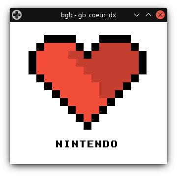
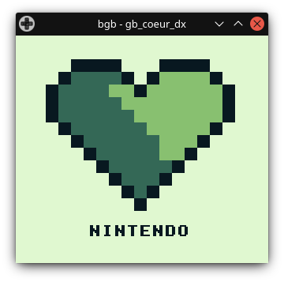

 # GameBoy-Coeur-DX
 
 ## C'est quoi ce truc ? / WTF is that ?
 FR : La cadeau parfait à offrir à votre moitié !  
 EN : The perfect gift to offer to your loved one !

## Comment l'assembler ? / How to assemble it ?
FR : Remplissez la chaîne de caractère en majuscules dans le fichier src/graphics/text/text.asm  
Puis tapez ```make``` dans un terminal (Vous devez avoir installé [RGBDS](https://github.com/gbdev/rgbds) en premier)

EN : Fill the string in capital letters in the file src/graphics/text/text.asm  
Then type ```make``` in a terminal (You must have installed [RGBDS](https://github.com/gbdev/rgbds) first)

## Captures d'écran / Screenshots


